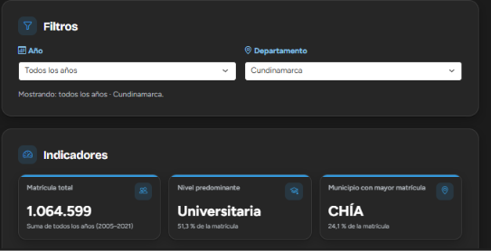
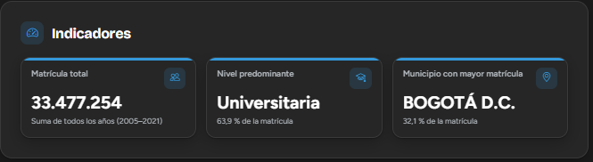
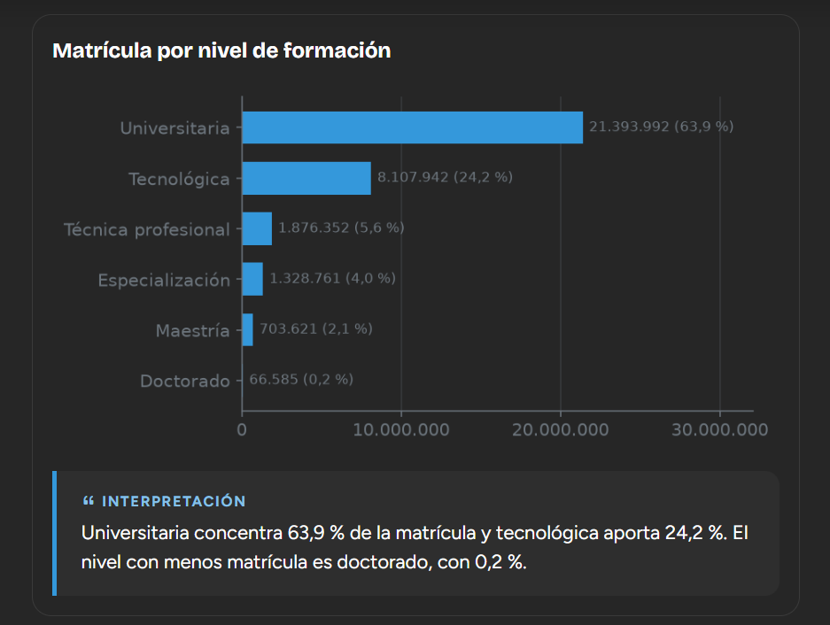
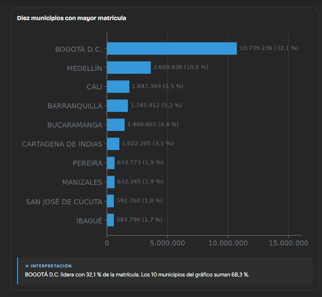
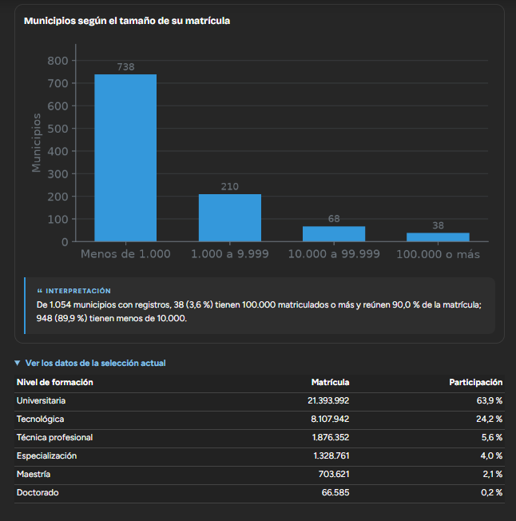
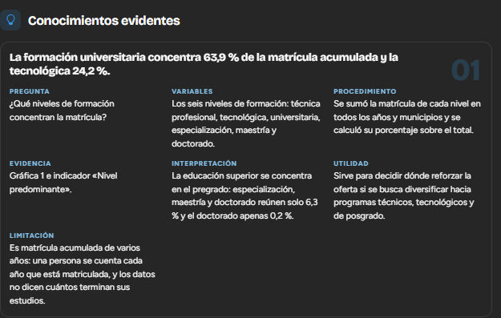
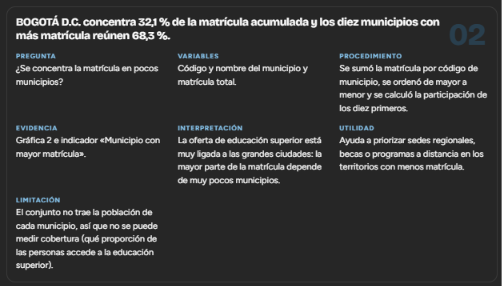
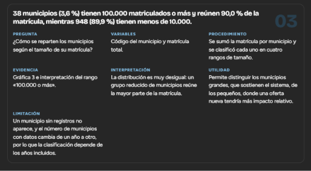
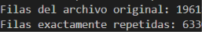
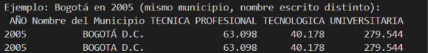

# Dimensión poblacional

## Responsable

Integrante 1: Camila Parra Berrio. Además de esta dimensión, me corresponde administrar el repositorio: crear la estructura inicial, definir las reglas de integración (CONTRIBUTING.md), proteger la rama `main` y revisar y fusionar los pull requests del equipo.

## Pregunta de análisis

¿Cómo está compuesta y distribuida la población analizada según sus principales características?

## Fuente de datos

Ministerio de Educación Nacional (MEN), estadísticas de matrícula en educación superior por municipio (SNIES), periodo 2005-2021. Los datos se descargaron del Portal de Datos Abiertos de Colombia.

## Variables utilizadas

| Variable | Tipo | Uso en esta dimensión |
|---|---|---|
| Año | Temporal | Filtro por año (2005-2021) |
| Código del departamento | Territorial | Filtro por departamento (se muestra con su nombre) |
| Código y nombre del municipio | Territorial | Agrupar la matrícula por municipio y clasificarlos por tamaño |
| Seis niveles de formación (técnica profesional, tecnológica, universitaria, especialización, maestría y doctorado) | Numérica | Composición de la matrícula por nivel |
| Matrícula total | Numérica derivada | Suma de los seis niveles; base de los indicadores y los porcentajes |

## Procedimiento

1. Revisé el archivo original y encontré registros repetidos: casi todas las filas de 2005 a 2020 aparecían dos veces, a veces con el nombre del municipio escrito distinto (por ejemplo "BOGOTÁ D.C." y "BOGOTA D.C."). Esto inflaba los totales al doble y hacía parecer que en 2021 había una caída que en realidad no existe.
2. Las cifras venían con punto como separador de miles y algunas con coma decimal, así que las convertí a números antes de calcular.
3. Normalicé los códigos de departamento y municipio y eliminé las filas repetidas comparando año, código del municipio y cifras. Esta limpieza quedó en `components/datos.py` para que todas las dimensiones trabajen con los mismos datos.
4. Programé los indicadores y las gráficas en `components/poblacional.py` con pandas y matplotlib, y los conecté a la página con dos filtros: año y departamento.
5. Algunos municipios aparecen más de una vez en el mismo año con cifras distintas. No los traté como duplicados: sumé sus valores.

## Filtros interactivos

- Año (todos o uno específico).
- Departamento (todos o uno específico).

## Indicadores

Con los filtros en "Todos":

| Indicador | Valor |
|---|---|
| Matrícula total (suma 2005-2021) | 33.477.254 |
| Nivel predominante | Universitaria (63,9 %) |
| Municipio con mayor matrícula | Bogotá D.C. (32,1 %) |

## Visualizaciones e interpretación

### 1. Matrícula por nivel de formación

La formación universitaria concentra el 63,9 % de la matrícula y la tecnológica el 24,2 %. Los posgrados (especialización, maestría y doctorado) suman solo el 6,3 %, y el doctorado es el nivel con menos matrícula (0,2 %).

### 2. Diez municipios con mayor matrícula

Bogotá D.C. lidera con el 32,1 % de la matrícula. Los diez municipios con más matrícula suman el 68,3 %.

### 3. Municipios según el tamaño de su matrícula

De 1.054 municipios con registros, 38 tienen 100.000 matriculados o más y reúnen el 90,0 % de la matrícula, mientras que 948 tienen menos de 10.000.

## Conocimientos evidentes

### Conocimiento 1: la matrícula se concentra en la formación universitaria

- **Pregunta:** ¿qué niveles de formación concentran la matrícula?
- **Variables:** los seis niveles de formación.
- **Procedimiento:** sumé la matrícula de cada nivel en todos los años y municipios y calculé su porcentaje sobre el total.
- **Evidencia:** gráfica 1 e indicador "Nivel predominante".
- **Hallazgo:** la formación universitaria concentra el 63,9 % de la matrícula acumulada y la tecnológica el 24,2 %.
- **Interpretación:** la educación superior se concentra en el pregrado: especialización, maestría y doctorado reúnen solo el 6,3 % y el doctorado apenas el 0,2 %.
- **Utilidad:** sirve para decidir dónde reforzar la oferta si se busca diversificar hacia programas técnicos, tecnológicos y de posgrado.
- **Limitación:** es matrícula acumulada de varios años (una persona se cuenta cada año que está matriculada) y los datos no dicen cuántos terminan sus estudios.

### Conocimiento 2: la matrícula se concentra en pocos municipios

- **Pregunta:** ¿se concentra la matrícula en pocos municipios?
- **Variables:** código y nombre del municipio y matrícula total.
- **Procedimiento:** sumé la matrícula por código de municipio, la ordené de mayor a menor y calculé la participación de los diez primeros.
- **Evidencia:** gráfica 2 e indicador "Municipio con mayor matrícula".
- **Hallazgo:** Bogotá D.C. concentra el 32,1 % de la matrícula acumulada y los diez municipios con más matrícula reúnen el 68,3 %.
- **Interpretación:** la oferta de educación superior está muy ligada a las grandes ciudades.
- **Utilidad:** ayuda a priorizar sedes regionales, becas o programas a distancia en los territorios con menos matrícula.
- **Limitación:** el conjunto no trae la población de cada municipio, así que no se puede medir cobertura.

### Conocimiento 3: el tamaño de los municipios es muy desigual

- **Pregunta:** ¿cómo se reparten los municipios según el tamaño de su matrícula?
- **Variables:** código del municipio y matrícula total.
- **Procedimiento:** sumé la matrícula por municipio y clasifiqué cada uno en cuatro rangos de tamaño.
- **Evidencia:** gráfica 3.
- **Hallazgo:** 38 municipios (3,6 %) tienen 100.000 matriculados o más y reúnen el 90,0 % de la matrícula, mientras 948 (89,9 %) tienen menos de 10.000.
- **Interpretación:** un grupo muy reducido de municipios reúne casi toda la matrícula.
- **Utilidad:** permite distinguir los municipios grandes, que sostienen el sistema, de los pequeños, donde una oferta nueva tendría más impacto relativo.
- **Limitación:** un municipio sin registros no aparece, y la cantidad de municipios con datos cambia de un año a otro.

## Limitación general

La matrícula acumulada cuenta a una persona cada año que está matriculada, así que no equivale a estudiantes únicos. Algunos municipios aparecen en varias filas del mismo año con cifras distintas y por eso se suman. Además, el conjunto no trae población por municipio ni datos de deserción o graduación, por lo que no permite medir cobertura ni explicar por qué la matrícula se concentra. Dos registros de 2012 (Bogotá y Cartagena) traen decimales, que se dejaron tal cual porque la diferencia es menor a una persona.

## Decisión sustentada

Como los diez municipios con más matrícula reúnen el 68,3 % del total, una entidad de educación podría priorizar sedes regionales, becas o programas a distancia en los municipios con menos matrícula, en lugar de seguir ampliando la oferta solo en las grandes ciudades.

## Evidencias del proceso de limpieza

Antes de limpiar, el archivo original tenía 19.618 filas y 6.330 eran repetidas exactas. Además, un mismo municipio aparecía con el nombre escrito de dos formas y los mismos valores.

 