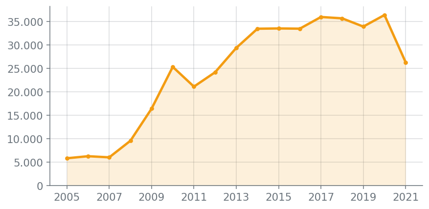
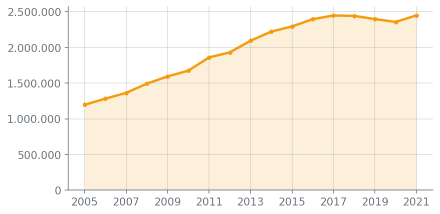
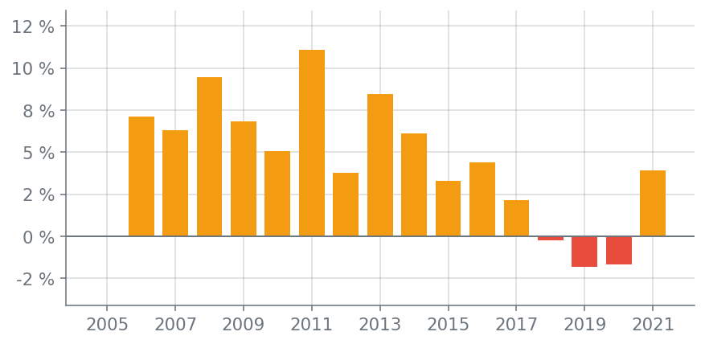
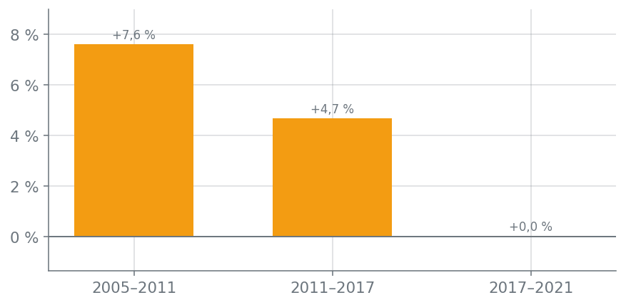

# Dimensión temporal

## Responsable

Integrante 3: Nicolas Suarez Rativa. Además de esta dimensión, me corresponde preparar y publicar la aplicación (`requirements.txt`, `render.yaml`, despliegue en Render y verificación de la URL pública).

## Pregunta de análisis

¿Cómo ha cambiado el comportamiento de la población durante el periodo disponible?

## Fuente de datos

Ministerio de Educación Nacional (MEN), estadísticas de matrícula en educación superior por municipio (SNIES), periodo 2005-2021. Los datos se descargaron del Portal de Datos Abiertos de Colombia.

## Variables utilizadas

| Variable | Tipo | Uso en esta dimensión |
|---|---|---|
| Año | Temporal | Eje de tiempo de las tres gráficas (2005-2021) |
| Código del departamento | Territorial | Filtro por departamento |
| Seis niveles de formación (técnica profesional, tecnológica, universitaria, especialización, maestría y doctorado) | Numérica | Filtro por nivel de formación y comparación de su evolución |
| Matrícula total | Numérica derivada | Suma de los seis niveles; base de los indicadores y la variación anual |

## Procedimiento

1. Parto de `components/datos.py` (función `cargar_datos()`), que ya deja el CSV limpio y sin las filas repetidas que traía el archivo original. No leí el CSV por mi cuenta.
2. Agrupé la matrícula por año (y, según el filtro activo, también por departamento o por un nivel de formación específico) con `components/temporal.py`.
3. Calculé la variación porcentual de cada año frente al anterior.
4. Calculé la tasa de crecimiento anual compuesta en tres periodos (2005-2011, 2011-2017, 2017-2021) para ver si el ritmo de crecimiento se mantuvo, se aceleró o se frenó.
5. Las tres gráficas se generan con matplotlib en el servidor, no son imágenes sueltas: se recalculan en cada solicitud según los filtros.

## Filtros interactivos

- Departamento (todos o uno específico).
- Nivel de formación (todos o uno específico).

## Indicadores

Con los filtros en "Todos" (nacional, todos los niveles):

| Indicador | Valor |
|---|---|
| Matrícula en 2021 (último año disponible) | 2.448.271 |
| Crecimiento 2005-2021 | +104,6 % (frente a 1.196.690 en 2005) |
| Año de mayor aumento | 2011 (+11,1 % frente a 2010) |

## Visualizaciones e interpretación

### 1. Evolución anual de la matrícula

La matrícula nacional se duplica entre 2005 y 2021 (de 1.196.690 a 2.448.271). Crece todos los años hasta 2017, baja entre 2018 y 2020 y en 2021 marca el valor más alto del periodo.

### 2. Variación porcentual frente al año anterior

Los aumentos son la regla hasta 2017, con el pico en 2011 (+11,1 %). Solo 2018, 2019 y 2020 muestran caídas (-0,2 %, -1,8 % y -1,7 %) y 2021 vuelve a crecer (+3,9 %).

### 3. Crecimiento anual promedio por periodo

El ritmo se frena por etapas: 7,6 % anual entre 2005 y 2011, 4,7 % entre 2011 y 2017 y prácticamente 0 % entre 2017 y 2021 (la matrícula de 2021 es casi igual a la de 2017).

## Conocimientos evidentes

### Conocimiento 1: la matrícula total se duplicó entre 2005 y 2021

- **Pregunta:** ¿cómo evolucionó la matrícula total entre 2005 y 2021?
- **Variables:** año y matrícula total (suma de los seis niveles), a escala nacional.
- **Procedimiento:** sumé la matrícula de todos los municipios por año y calculé la variación porcentual anual y la tasa de crecimiento anual compuesta.
- **Evidencia:** gráficas 1 y 2, e indicadores "Matrícula en 2021" y "Crecimiento 2005-2021".
- **Hallazgo:** la matrícula pasó de 1.196.690 (2005) a 2.448.271 (2021), y creció cada año hasta 2017.
- **Interpretación:** entre 2005 y 2017 la matrícula aumentó 104,4 % (unos 6,1 % anual), señal de una expansión sostenida de la educación superior.
- **Utilidad:** sirve de línea base para proyectar cupos y financiación futura.
- **Limitación:** es matrícula agregada por municipio y año; no equivale a estudiantes únicos ni explica las causas del crecimiento.

### Conocimiento 2: el crecimiento se frenó a partir de 2017

- **Pregunta:** ¿hubo periodos de disminución o estancamiento?
- **Variables:** año y variación porcentual anual de la matrícula total.
- **Procedimiento:** comparé cada año con el anterior y conté los años con variación negativa; luego comparé el ritmo de tres periodos.
- **Evidencia:** gráficas 2 y 3.
- **Hallazgo:** entre 2017 y 2020 la matrícula bajó 3,7 % (de 2.446.314 a 2.355.603) tras tres años seguidos de caída; en 2021 se recuperó (+3,9 %).
- **Interpretación:** el crecimiento anual promedio pasó de 7,6 % (2005-2011) a 4,7 % (2011-2017) y a casi 0 % (2017-2021): el sistema dejó de expandirse al ritmo anterior.
- **Utilidad:** permite priorizar estrategias de permanencia y de atracción de nuevos estudiantes.
- **Limitación:** con datos anuales no se puede saber si la caída de 2018-2020 fue temporal ni cuáles fueron sus causas.

### Conocimiento 3: la composición por nivel de formación cambió

- **Pregunta:** ¿cambió la composición de la matrícula por nivel de formación?
- **Variables:** año y matrícula de cada nivel de formación.
- **Procedimiento:** filtré cada nivel (filtro "Nivel de formación") y comparé 2005, el año de cambio y 2021.
- **Evidencia:** gráfica 1 con el filtro de nivel aplicado.
- **Hallazgo:** la tecnológica pasó de 13,3 % a 25,2 % de la matrícula (×3,9), maestría se multiplicó ×6,1 y la técnica profesional cayó de 224.026 (2008) a 92.941 (2010).
- **Interpretación:** la formación tecnológica y los posgrados ganan peso, mientras la técnica profesional pierde participación de forma abrupta desde 2009.
- **Utilidad:** orienta la oferta de programas hacia los niveles que más crecen.
- **Limitación:** el cambio brusco de 2009 podría deberse a reclasificación de programas; los datos no lo confirman.

## Limitación general

Los datos son anuales, no permiten analizar comportamientos estacionales (trimestre o mes). Además, el número de municipios con registros cambia de un año a otro (816 en 2012 y 360 en 2021), por lo que parte de las variaciones podría reflejar cambios de cobertura y no solo de matrícula real. Tampoco se puede concluir por qué ocurren los aumentos o las caídas.

## Decisión sustentada

Como la matrícula total no crece desde 2017, las instituciones y el Ministerio podrían destinar recursos a programas de permanencia y a ampliar la oferta tecnológica y de posgrado (los niveles que más crecieron), en lugar de solo aumentar cupos de pregrado universitario. Sustento: crecimiento anual de 7,6 % (2005-2011) frente a ~0 % (2017-2021), y participación de la tecnológica de 13,3 % a 25,2 %.
