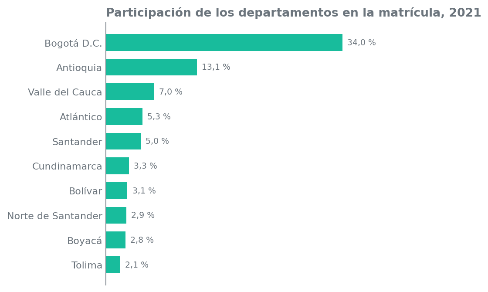
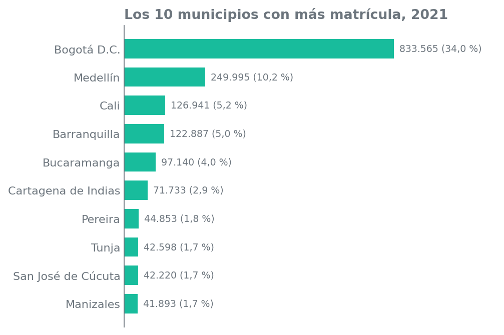
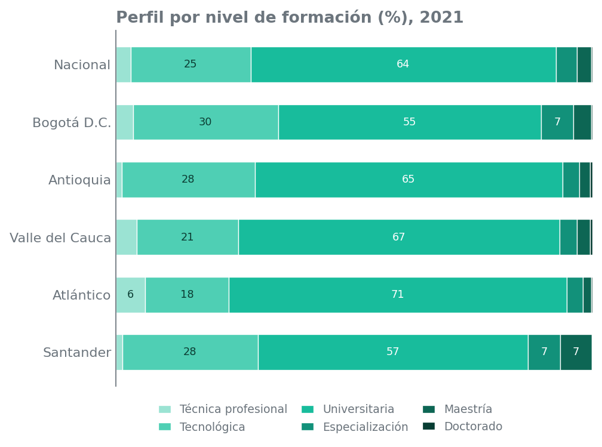
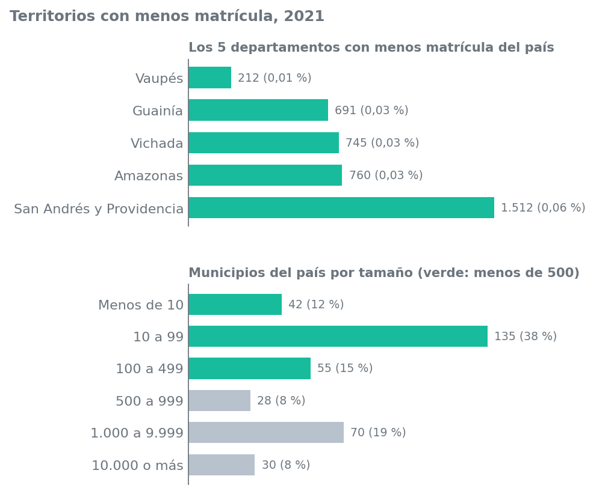

# Dimensión territorial

**Responsable:** Integrante 2 (Jonathan)
**Rama:** `feature/dimension-territorial`
**Archivos de esta dimensión:** `components/territorial.py`, `templates/dimensiones/territorial.html`, `static/css/territorial.css` y esta carpeta `docs/territorial/`.

> Este documento es la "libreta" del análisis: aquí está **qué datos usé, cómo los calculé y a qué conclusión llegué**. La página web (`territorial.html`) muestra lo mismo, pero con filtros. Los espacios marcados con 📎 son para pegar las evidencias que salen de correr el código (ver sección 10).

---

## 1. La pregunta

> ¿Cómo se distribuye la población y sus principales características entre los territorios disponibles?

En este caso: **¿dónde está la matrícula de educación superior?** ¿Qué departamentos y municipios concentran más estudiantes, cuáles casi no aparecen y en qué se diferencian?

---

## 2. Los datos que usé

Todo sale de `components/datos.py` (función `cargar_datos()`), que ya deja el CSV limpio. **No leí el CSV directo**, y a continuación se explica por qué.

| Variable | Tipo | Para qué la usé |
|---|---|---|
| Año | Temporal | Filtro: elegir el año que se analiza |
| Código del departamento | Territorial | Identificar el departamento (el nombre sale de la lista DANE) |
| Código y nombre del municipio | Territorial | Agrupar por municipio sin duplicar nombres escritos distinto |
| Seis niveles de formación (técnica profesional, tecnológica, universitaria, especialización, maestría, doctorado) | Numérica | Armar la matrícula total y el perfil de cada territorio |
| Matrícula total | Numérica (derivada) | Suma de los seis niveles; con ella se calcularon todos los porcentajes |

### ⚠️ A tener en cuenta: registros duplicados en el CSV original

El CSV trae casi todas las filas de 2005 a 2020 **repetidas** (a veces con el nombre del municipio escrito distinto, como "BOGOTÁ" y "BOGOTA"). `datos.py` las quita:

| | Filas | Matrícula 2017 |
|---|---:|---:|
| CSV sin limpiar | 19.618 | 4.892.628 |
| Datos limpios | 9.989 | **2.446.314** |

Si alguien suma el CSV directo, **todo sale multiplicado por 2** (menos 2021, que no está repetido). Por eso se trabajó siempre con `cargar_datos()`.

---

## 3. Decisiones antes de empezar

Estas decisiones cambian los resultados, así que se dejaron registradas:

1. **Analicé un solo año a la vez** (por defecto 2021, el último). No sumé 2005–2021 porque la matrícula acumulada cuenta varias veces a los mismos estudiantes.
2. **No comparé años por número de municipios.** Los municipios con datos cambian mucho: 816 en 2012 y 313 en 2018. Si sumara todo el periodo, mezclaría cobertura con matrícula real.
3. **Excluí las filas "No identificado"** (6 filas en todo el periodo, sin departamento ni municipio).
4. **Agrupé los municipios por código**, no por nombre, y **sumé sus filas del mismo año** (301 municipio-año tienen más de una fila y no son repetidas: sus cifras son distintas).
5. **Bogotá D.C. es ciudad y departamento a la vez** (código 11). Cuando se filtra por Bogotá solo hay un municipio.
6. **Dos umbrales que definí:** "municipio pequeño" = menos de 500 matriculados; "departamento grande" = más de 50.000 matriculados.
7. **Para los territorios con menos matrícula, los departamentos van en ranking y los municipios por rangos.** En 2021, 21 municipios tienen exactamente 1 matriculado, así que un "top 5 de municipios más pequeños" sería arbitrario (saldría por orden de código). Por eso agrupé los municipios por rango de matrícula.

---

## 4. Filtros

| Filtro | Qué hace |
|---|---|
| **Año** (2005–2021) | Cambia el año de todo el tablero |
| **Departamento** (o "Todos") | Con "Todos" se ve el país; con un departamento se ven sus municipios y su perfil |

Los dos filtros actualizan los 3 indicadores, las 4 gráficas (la actividad pide mínimo 3), las tablas y los textos.

---

## 5. Indicadores

Los valores de abajo son los de **2021 con "Todos"** (se pueden confirmar con `00_resumen_cifras.txt`).

### Indicador 1. Participación del departamento líder

- **Qué mide:** qué porcentaje de la matrícula del país tiene el departamento que más estudiantes reúne. Con un departamento filtrado, muestra su propia participación y su puesto.
- **Cómo se calcula:** se suma la matrícula total por departamento, se divide entre el total del país y se toma el mayor.
- **Resultado 2021:** **34,0 %** (Bogotá D.C., 833.565 matriculados).

📎 **Evidencia 5.1** — captura de los indicadores en el tablero: `evidencias/captura_indicadores_pais_2021.png`

### Indicador 2. Peso de los 10 municipios principales

- **Qué mide:** cuánta de la matrícula del país queda en solo 10 municipios. Con un departamento filtrado, muestra qué porcentaje del departamento tiene su municipio principal.
- **Cómo se calcula:** se suma la matrícula por código de municipio, se ordena de mayor a menor y se suman los 10 primeros.
- **Resultado 2021:** **68,4 %** de la matrícula está en 10 municipios (de 360 con matrícula).

📎 **Evidencia 5.2** — `evidencias/05_tabla_top_municipios_2021.csv` (pegar captura de la tabla)

### Indicador 3. Municipios con matrícula (y mediana)

- **Qué mide:** cuántos municipios tienen matrícula y cuánta tiene el municipio "típico" (la mediana).
- **Cómo se calcula:** se cuentan los municipios con matrícula mayor que 0 y se calcula la mediana de su matrícula.
- **Resultado 2021:** **360 municipios**, con una mediana de **114 matriculados**.

📎 **Evidencia 5.3** — `evidencias/00_resumen_cifras.txt` (pegar captura de la consola)

---

## 6. Visualizaciones

### Gráfica 1. Participación de los departamentos

- **Qué muestra:** barras con el % de la matrícula del país de los 10 departamentos más grandes (si se filtra un departamento que no está en el top, se agrega al final con su puesto).
- **Cómo se lee:** entre más larga la barra, más peso tiene el departamento en el total nacional.
- **Interpretación (2021):** Bogotá D.C. lidera con 34,0 % y los cinco primeros departamentos suman 64,4 %. En el otro extremo, Vaupés tiene apenas 0,01 % (212 matriculados).

📎 **Evidencia 6.1** — `evidencias/01_participacion_departamentos_2021.png`

### Gráfica 2. Municipios con más matrícula

- **Qué muestra:** los 10 municipios con más matrícula del país (o del departamento filtrado), con la cifra y su %.
- **Cómo se lee:** compara el tamaño de las ciudades entre sí y frente al total.
- **Interpretación (2021):** los 10 principales suman 68,4 %. Bogotá D.C. va primero (34,0 %) y Medellín segundo (10,2 %); solo 18 municipios reúnen el 80 %.

📎 **Evidencia 6.2** — `evidencias/02_top_municipios_2021.png`

### Gráfica 3. Perfil por nivel de formación

- **Qué muestra:** barras apiladas al 100 %: de cada territorio, qué parte de su matrícula es técnica, tecnológica, universitaria, especialización, maestría o doctorado. Se compara el país con los 5 departamentos más grandes (o con el departamento filtrado).
- **Cómo se lee:** cada barra suma 100 %; si un color es más ancho en un territorio que en el país, ese nivel pesa más allí.
- **Interpretación (2021):** en el país el 64 % es universitaria y el 25 % tecnológica; el posgrado pesa 7,7 %. Entre los cinco más grandes, Santander tiene más posgrado (13,6 %) y Atlántico menos (5,4 %).

📎 **Evidencia 6.3** — `evidencias/03_perfil_niveles_2021.png`

### Gráfica 4. Los territorios con menos matrícula

- **Qué muestra:** dos paneles. Arriba, los **5 departamentos con menos matrícula** del país. Abajo, **cuántos municipios hay en cada rango de matrícula** (menos de 10, 10 a 99, 100 a 499, 500 a 999, 1.000 a 9.999 y 10.000 o más), en el país o en el departamento filtrado. En verde están los municipios de menos de 500 matriculados.
- **Cómo se lee:** arriba, entre más corta la barra, menos matrícula tiene el departamento. Abajo, cada barra cuenta municipios, no estudiantes.
- **Interpretación (2021):** Vaupés, Guainía, Vichada, Amazonas y San Andrés y Providencia suman 3.920 matriculados, solo el 0,16 % del país; Vaupés es el último con 212. Entre los municipios, 177 de 360 tienen menos de 100 matriculados y 21 registran apenas 1.
- **Por qué los municipios van por rangos:** ver decisión 7 de la sección 3 (hay 21 empatados con 1 matriculado).

📎 **Evidencia 6.4** — `evidencias/08_territorios_menor_matricula_2021.png`

📎 **Evidencia 6.5** — tablas de apoyo: `evidencias/09_cinco_departamentos_menores_2021.csv` y `evidencias/10_municipios_por_rango_2021.csv`

---

## 7. Conocimientos evidentes

Los tres siguen la estructura que pide la actividad. Son del año 2021 a nivel nacional.

### Conocimiento 1. La matrícula está concentrada en pocos territorios

| Campo | Contenido |
|---|---|
| **Pregunta** | ¿Qué tan concentrada está la matrícula en pocos territorios? |
| **Variables** | Año, departamento, municipio y matrícula total |
| **Procedimiento** | Se filtró 2021, se sumó la matrícula por departamento y por municipio, se calculó el % sobre el total nacional y se acumuló de mayor a menor |
| **Evidencia** | Gráficas 1 y 2, indicadores 1 y 2 |
| **Hallazgo** | Bogotá D.C. reúne el 34,0 % de la matrícula, los cinco primeros departamentos el 64,4 % y solo 18 municipios llegan al 80 % |
| **Interpretación** | La matrícula está muy concentrada en pocas ciudades grandes (Bogotá D.C., Medellín, Cali y Barranquilla); la mayor parte del territorio aporta muy poco |
| **Utilidad** | Ayuda a ver dónde está la capacidad instalada y dónde haría falta llevar oferta (programas regionales, sedes o virtualidad) |
| **Limitación** | Es matrícula registrada por municipio: no dice dónde vive el estudiante ni si viaja a estudiar a otra ciudad |

📎 **Evidencia 7.1** — `evidencias/04_tabla_departamentos_2021.csv` (columna de porcentaje acumulado)

### Conocimiento 2. La gran mayoría de municipios tiene muy poca matrícula

| Campo | Contenido |
|---|---|
| **Pregunta** | ¿Cómo se reparte la matrícula entre los municipios más pequeños? |
| **Variables** | Año, municipio y matrícula total |
| **Procedimiento** | Se sumó la matrícula por municipio en 2021, se calculó la mediana y se contaron los municipios con menos de 500 matriculados |
| **Evidencia** | Indicador 3, gráfica 2, gráfica 4 (municipios por rango de matrícula) y tabla de datos |
| **Hallazgo** | 232 de 360 municipios (64 %) tienen menos de 500 matriculados, la mediana es de 114 y 21 registran apenas 1 |
| **Interpretación** | Bogotá D.C. tiene unas 7.300 veces la matrícula del municipio típico: la desigualdad entre municipios grandes y pequeños es enorme |
| **Utilidad** | Permite identificar municipios con muy poca presencia de educación superior para pensar en apoyos o programas a distancia |
| **Limitación** | Un municipio con poca matrícula puede ser simplemente pequeño o estar cerca de una ciudad grande; sin datos de población por municipio no se sabe cuál es el caso |

📎 **Evidencia 7.2** — `evidencias/10_municipios_por_rango_2021.csv`, `evidencias/05_tabla_top_municipios_2021.csv` y `evidencias/07_cobertura_municipios_por_anio.csv`

### Conocimiento 3. Los departamentos grandes no tienen el mismo perfil

| Campo | Contenido |
|---|---|
| **Pregunta** | ¿Los departamentos grandes tienen la misma mezcla de niveles de formación? |
| **Variables** | Año, departamento y la matrícula de los seis niveles |
| **Procedimiento** | Con los departamentos de más de 50.000 matriculados en 2021 se calculó el % de cada nivel, se agrupó especialización + maestría + doctorado como "posgrado" y se comparó con el promedio nacional |
| **Evidencia** | Gráfica 3 |
| **Hallazgo** | Santander tiene 13,6 % de posgrado y Tolima solo 2,1 % (país: 7,7 %); Cundinamarca tiene 32,1 % en tecnológica frente a 25,2 % del país |
| **Interpretación** | Los departamentos grandes no se parecen entre sí: unos se inclinan hacia los posgrados y otros hacia la formación tecnológica |
| **Utilidad** | Sirve para ajustar la oferta a cada territorio, por ejemplo reforzar posgrados donde casi no existen |
| **Limitación** | Solo se compararon departamentos de más de 50.000 matriculados y los datos no explican si la diferencia viene de la demanda, de las instituciones o de cómo se registran los programas |

📎 **Evidencia 7.3** — `evidencias/06_perfil_departamentos_2021.csv`

---

## 8. Limitación del análisis

Los datos dicen **cuánta matrícula se registra en cada municipio**, pero no dónde vive el estudiante ni cuánta gente vive en cada territorio. Por eso **no es posible afirmar que un lugar esté "desatendido"** ni comparar por habitante: solo se compararon cantidades. Además, el número de municipios con datos cambia de un año a otro (816 en 2012 y 313 en 2018), así que conviene comparar dentro de un mismo año. Tampoco hay zona urbana/rural.

---

## 9. Decisión sustentada

**Posible decisión:** como la matrícula está tan concentrada, el Ministerio y las instituciones podrían priorizar un estudio para ampliar la oferta (extensión o virtual) en los departamentos con menos matrícula, cruzándolo antes con su población.

**Sustento:** Bogotá D.C. concentra 34,0 % de la matrícula, mientras Vaupés (212), Guainía (691), Vichada (745), Amazonas (760) y San Andrés y Providencia (1.512) apenas suman 3.920 matriculados en 2021 (gráfica 4).

